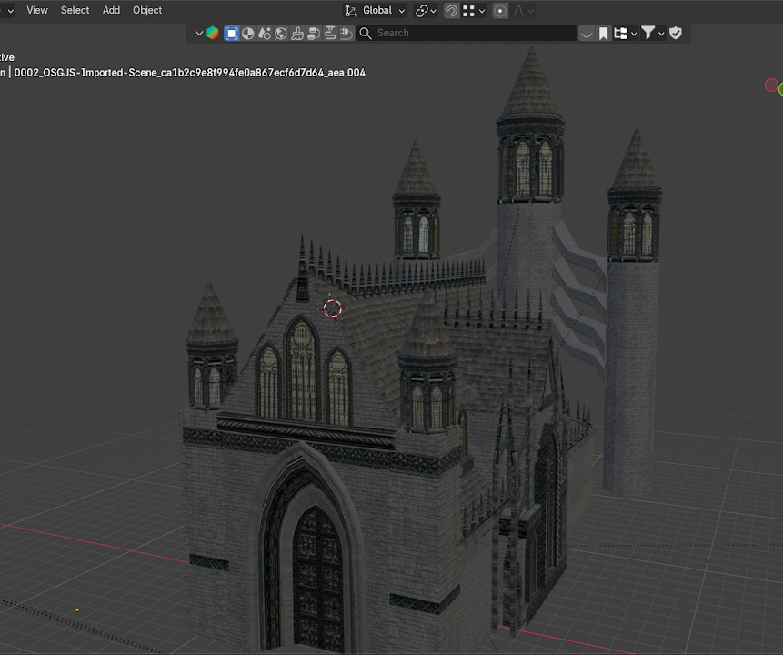
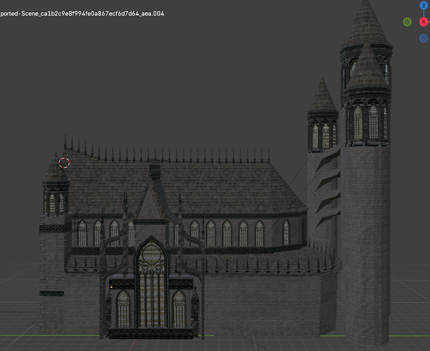

# TAlleks

### Unity · C# · Blender · VR / XR

Игровые механики, виртуальная реальность и трёхмерные миры — от модели в Blender до интерактивной сцены в Unity.

[Проекты](#-избранные-проекты) · [3D-модель Church](#-blender--3d-моделирование) · [Все репозитории](https://github.com/TAlleks?tab=repositories)

---

## ▹ Направления

🎮 **Разработка игр** — прототипы на Unity, игровая логика на C#, физика и интерфейсы.

🥽 **VR / XR** — взаимодействие руками, полёт, управление объектами и погружение через XR Interaction Toolkit и OpenXR.

🎨 **Blender и 3D** — архитектурное моделирование, работа с формой и деталями, материалы, текстуры и подготовка моделей к экспорту в игровые движки.

## ▹ Технологии

## ▹ Blender · 3D-моделирование

### C H U R C H

**Детализированная модель готической церкви**

Архитектурная работа с выразительным силуэтом и большим количеством повторяющихся деталей: центральная башня, боковые башни, стрельчатые окна, контрфорсы, арочные входы, скатная кровля и декоративные элементы фасада.

Модель собрана в Blender с вниманием к пропорциям, ритму архитектуры и читаемости формы. Отдельно проработаны фасад, башни, оконные проёмы, кровля и материалы здания.

<table>
<tr>
<td width="50%"></td>
<td width="50%"></td>
</tr>
<tr>
<td align="center">Общий вид архитектурной модели</td>
<td align="center">Детали фасада и башен</td>
</tr>
</table>

**Blender · Architectural Modeling · Materials · Texturing**

## ▹ Избранные проекты

<table>
<tr>
<td width="50%" valign="top">

### [L O N D O N E ↗](https://github.com/TAlleks/Londone)

**VR-взаимодействие на Unity 6**

Анимация рук, открытие ворот, восстановление здоровья и трёхмерное природное окружение.

**C# · XR Interaction Toolkit · OpenXR**

[Подробнее →](https://github.com/TAlleks/Londone#readme)

</td>
<td width="50%" valign="top">

### [K W I D I C H ↗](https://github.com/TAlleks/kwidich)

**Воздушный VR-спорт**

Полёт на метле, броски и перехват мяча, AI-соперники, кольца, табло и управление через Logitech G29.

**Unity 6 · C# · VR · G29**

[Геймплей и скриншоты →](https://github.com/TAlleks/kwidich#readme)

</td>
</tr>
</table>

---

**Моделирую миры и превращаю их в интерактивные пространства.**

